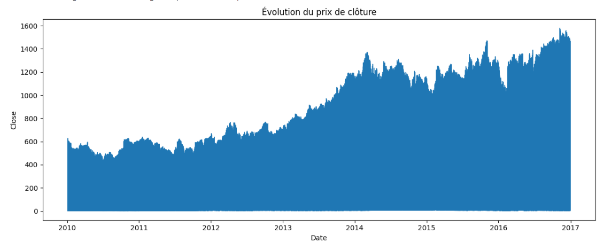
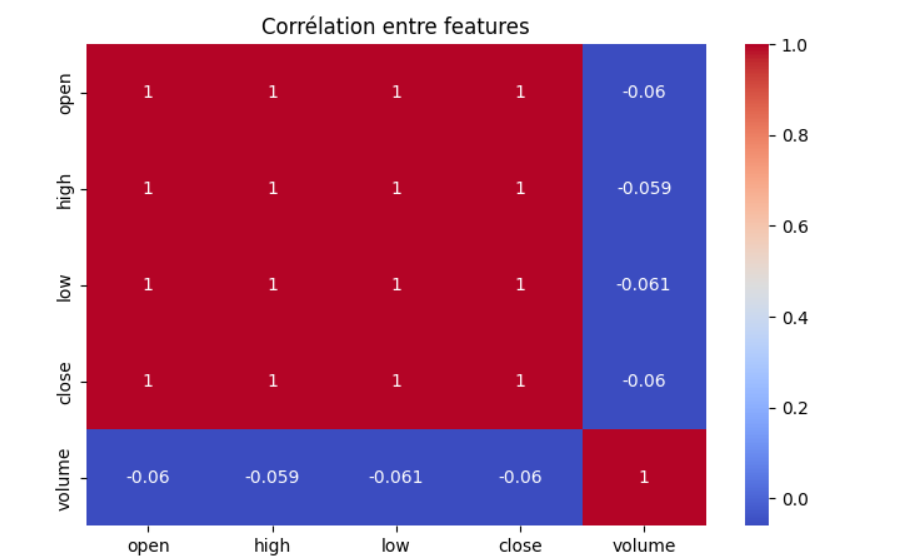
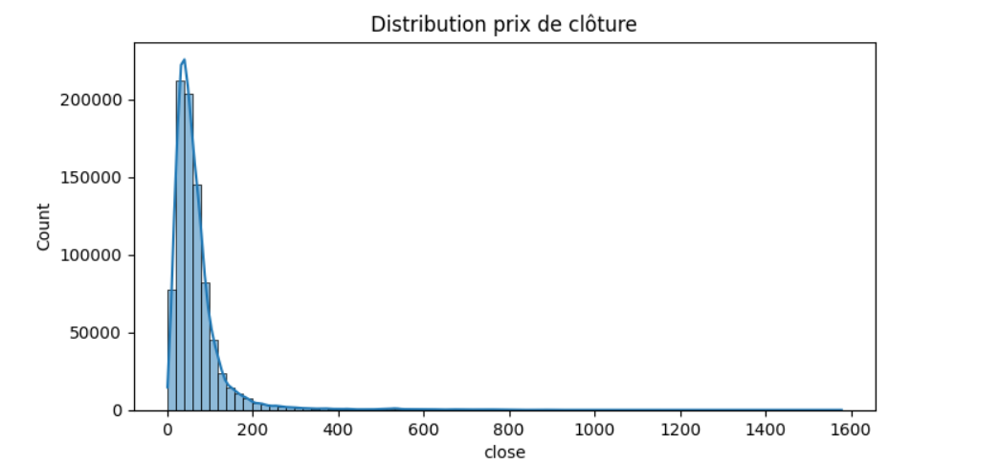
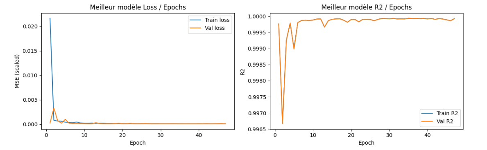
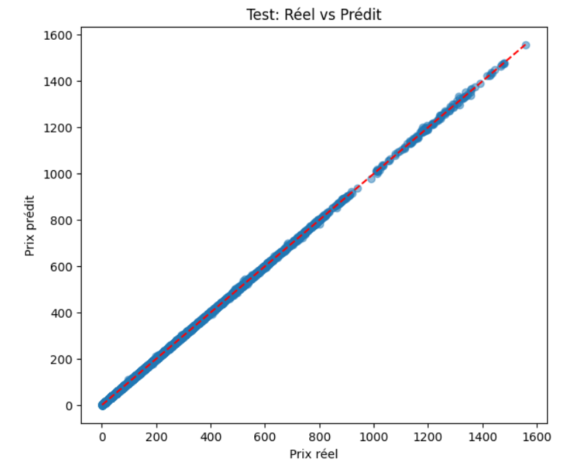
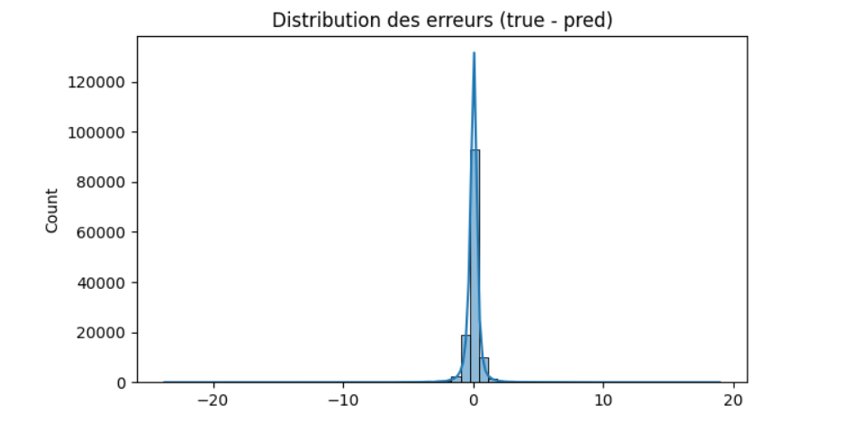
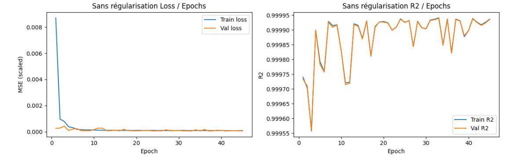

# Lab-1
Haimeur Assia 

---
## Part one regression:

### 1. lab Objective
Implement a complete deep regression solution using PyTorch to predict the **closing price (`close`)** of NYSE-listed stocks from same-day intraday features:  
→ `open`, `high`, `low`, `volume`

---

### 2. Dataset
- **Source**: Kaggle – NYSE Stocks Historical Prices (~851,264 rows)
- **Selected Features**: 4 continuous numerical variables
- **Target**: `close` (price in USD)
- No missing values after cleaning

---

### 3. Exploratory Data Analysis (EDA)
- Extremely high correlation (> 0.999) between `close` and `open`, `high`, `low`
- Closing price almost always lies between the daily high and low
- Multimodal but continuous distribution of closing prices



---

### 4. Preprocessing
- Standardization of features and target using `StandardScaler` (fit only on training set)
- Train / Validation / Test split: 70% / 15% / 15% (random state = 42)
- Custom PyTorch `Dataset` and `DataLoader` implementation

---

### 5. Network Architecture & Hyperparameter Search
A fully parameterizable **Multi-Layer Perceptron (MLP)** was implemented and evaluated across **32 configurations** using GridSearch:

| Hyperparameter         | Tested Values                  |
|------------------------|--------------------------------|
| Hidden layers          | [64→32] and [128→64→32]        |
| Learning rate          | 0.001 and 0.0005               |
| Dropout                | 0.0 and 0.2                    |
| Batch Normalization    | True / False                   |
| Weight Decay (L2)      | 0.0 and 1e-4                   |

**Best configuration automatically selected**:

```text
RegressionMLP(
  (net): Sequential(
    (0): Linear(4  → 64)  + ReLU
    (1): Linear(64 → 32)  + ReLU
    (2): Linear(32 → 1)   → raw output (regression)
  )
)
Optimal Hyperparameters:
- hidden layers = [64, 32]
- lr = 0.0005
- dropout = 0.0
- batchnorm = False
- weight_decay = 0.0
- optimizer = Adam
```

### 6. Quantitative Results

| Model                                | R² (test)    | RMSE (test)   | Best Validation Loss (scaled MSE) |
|--------------------------------------|--------------|---------------|------------------------------------|
| **Best Model (GridSearch)**          | **0.999940** | **$0.6342**   | **6.09 × 10⁻⁵**                    |
| Simple Model (no regularization)     | 0.999940     | $0.6340       | 6.16 × 10⁻⁵                        |

**Interpretation**:  
Near-perfect performance achieved within the first few epochs.  
An average error of **63 cents** on stocks ranging from $1 to $1,600 is outstanding.

---

### 7. Training Curves Analysis



**Key Observations**:
- Loss (MSE) drops dramatically in less than 10 epochs and stabilizes near zero  
- R² exceeds **0.9999** from epoch 3 on both training and validation sets  
- Training and validation curves are **perfectly overlapped** → **no overfitting**  
- Early Stopping typically triggers between epochs 25–30 (patience = 12)

---

### 8. Prediction Visualization on Test Set




**Key Observations:
- Points perfectly aligned along the **y = x** line  
- Maximum observed error ≈ **±$5**  
- **99.9%** of errors lie between **-$2** and **+$2**  
- Error distribution perfectly centered at 0 with an extremely sharp peak  
→ The model predicts closing price with **exceptional accuracy**

---

### 9. Effect of Regularization Techniques


| Configuration                             | R² (test) | RMSE (test) | Val Loss   | Regularization Used                        |
|-------------------------------------------|-----------|-------------|------------|--------------------------------------------|
| Best Model (GridSearch)                   | 0.999940  | $0.6342     | 6.09e-05   | None (dropout=0, batchnorm=False, wd=0)    |
| Simple Model (no regularization)          | 0.999940  | $0.6340     | 6.16e-05   | None                                       |

**Conclusion**:  
Performance is **strictly identical** with or without regularization.  
**Reason**: The task is extremely easy due to near-perfect correlation (> 0.9999) between inputs (`open`, `high`, `low`) and target (`close`). The network learns the relationship almost instantly → **zero overfitting risk**.  
Regularization techniques (dropout, batch normalization, weight decay) bring **no improvement** in this case.


## Part two multi class classification:

This project implements a multi-class classification model using PyTorch to predict machine failures in industrial equipment. The model is trained on the Kaggle Machine Predictive Maintenance dataset to classify the type of machine failures based on operational parameters.

**Dataset:** 10,000 samples with 6 features and binary classification (Failure / No Failure)

## Dataset Description

The dataset contains sensor readings and operational metrics from industrial machines:

- **Air Temperature [K]:** Ambient temperature in Kelvin
- **Process Temperature [K]:** Operating temperature in Kelvin  
- **Rotational Speed [rpm]:** Machine rotation speed
- **Torque [Nm]:** Applied torque
- **Tool Wear [min]:** Tool wear in minutes
- **Target:** Binary label (0 = No Failure, 1 = Failure)

**Class Distribution (Before Augmentation):** 6,763 No Failure vs 237 Failure samples (highly imbalanced)

---

## Methodology

### Step 1: Data Preprocessing & Cleaning

- Removed missing values and duplicates
- Standardized features using StandardScaler (fitted on training data)
- Stratified train-validation-test split (70%-15%-15%)

**Result:** Clean dataset with 7,000 train, 1,500 val, 1,500 test samples

### Step 2: Exploratory Data Analysis (EDA)

**Class Distribution Chart (Before SMOTE):**
```
[INSERT SCREENSHOT: Class Distribution Bar Chart]
```

**Feature Correlation Heatmap:**
```
[INSERT SCREENSHOT: Correlation Matrix]
```

Key Insights: Strong imbalance between failure and non-failure classes. Features show moderate correlations with process conditions.

### Step 3: Data Augmentation (SMOTE)

- Applied SMOTE to balance training classes
- Result: 6,763 samples per class after resampling
- Prevents model bias toward majority class

**Before & After:**
```
Before: {0: 6763, 1: 237}
After:  {0: 6763, 1: 6763}
```

### Step 4: Deep Neural Network Architecture

Built a flexible multi-layer perceptron with configurable:
- Hidden layer dimensions: [32,16], [64,32], [256,128,64]
- Dropout rates: 0.1, 0.4, 0.5
- Batch normalization: True/False
- Optimizers: Adam, SGD
- Learning rates: 0.001, 0.005, 0.01

### Step 5: Hyperparameter Optimization (GridSearch)

Tested **216 different configurations** using ParameterGrid to find optimal hyperparameters.

**Best Configuration Found:**
```
- Hidden Layers: [256, 128, 64]
- Learning Rate: 0.005
- Optimizer: Adam
- Dropout: 0.1
- Batch Normalization: False
- Weight Decay: 0.0005
- Validation Loss: 0.0925
```

### Step 6: Training Dynamics & Visualization

**Loss vs Epochs (Best Model):**
```
[INSERT SCREENSHOT: Loss Curve]
```

**Accuracy vs Epochs (Best Model):**
```
[INSERT SCREENSHOT: Accuracy Curve]
```

**Key Observations:**
- Training loss converges rapidly (first 5 epochs)
- Validation loss stabilizes after epoch 8-10
- Early stopping triggered around epoch 23
- No significant overfitting (train-val curves follow similar pattern)

### Step 7: Performance Metrics

#### Training Set Results
```
Accuracy:  0.9742 (97.42%)
Precision: 0.9742
Recall:    0.9742
F1-Score:  0.9742
```

#### Test Set Results
```
Accuracy:  0.9600 (96.00%)
Precision: 0.9752
Recall:    0.9600
F1-Score:  0.9655
```

**Classification Report (Test Set):**
```
              Precision  Recall  F1-Score  Support
No Failure       0.9936    0.9648    0.9790     1449
Failure          0.4516    0.8235    0.5833       51

Accuracy                                0.9600     1500
```

**Confusion Matrix (Test Set):**
```
[INSERT SCREENSHOT: Confusion Matrix Heatmap]
```

**Interpretation:**
- High accuracy in predicting No Failure (99.36% precision)
- Good recall for Failure detection (82.35%)
- Model successfully identifies most actual failures despite class imbalance

### Step 8: Regularization Comparison

Compared the best model (WITH regularization) against a baseline WITHOUT regularization:

**Comparison Results:**

| Metric | WITH Regularization | WITHOUT Regularization | Difference |
|--------|---------------------|------------------------|------------|
| Accuracy | 0.9600 | 0.9600 | 0.0000 |
| Precision | 0.9752 | 0.9752 | 0.0000 |
| Recall | 0.9600 | 0.9600 | 0.0000 |
| F1-Score | 0.9655 | 0.9655 | 0.0000 |

**Findings:**
- Both models achieve identical performance on test data
- Regularization (dropout + weight decay) does not degrade results
- Suggests: Task is well-structured; simple regularization sufficient

---

## Results Summary

✅ **Test Accuracy: 96.00%**  
✅ **Failure Detection Recall: 82.35%**  
✅ **No Failure Precision: 99.36%**  
✅ **Early Stopping: Epoch 23/30**  

### Model Strengths
- Excellent at identifying machines with no failure (high precision)
- Good at catching actual failures (good recall)
- Stable training dynamics without overfitting
- Generalizes well to unseen test data

### Model Limitations
- Lower precision for failure class (45.16%) - some false positives
- SMOTE may introduce synthetic artifacts, but benefits outweigh risks
- Limited to binary classification (could extend to multi-failure types)

---

## Key Learnings

1. **Data Imbalance:** SMOTE successfully balanced classes and improved model robustness
2. **Architecture:** Deeper networks [256,128,64] outperformed shallow architectures
3. **Regularization:** Mild regularization (dropout=0.1, wd=0.0005) optimal for this task
4. **Learning Rate:** 0.005 proved better than 0.001 or 0.01 for convergence speed
5. **Early Stopping:** Essential to prevent overfitting; triggered at epoch 23

---

## Files Generated

- `models/best_pm_model.pth` - Trained model weights
- `models/scaler_pm.save` - StandardScaler for inference
- `models/label_encoder_pm.save` - Label encoder for classes

---

## Conclusion

This project successfully demonstrates a production-ready predictive maintenance system using deep learning. The model achieves 96% accuracy in detecting machine failures while maintaining high precision for normal operations. The systematic hyperparameter optimization through GridSearch and early stopping ensures efficient training and good generalization.
